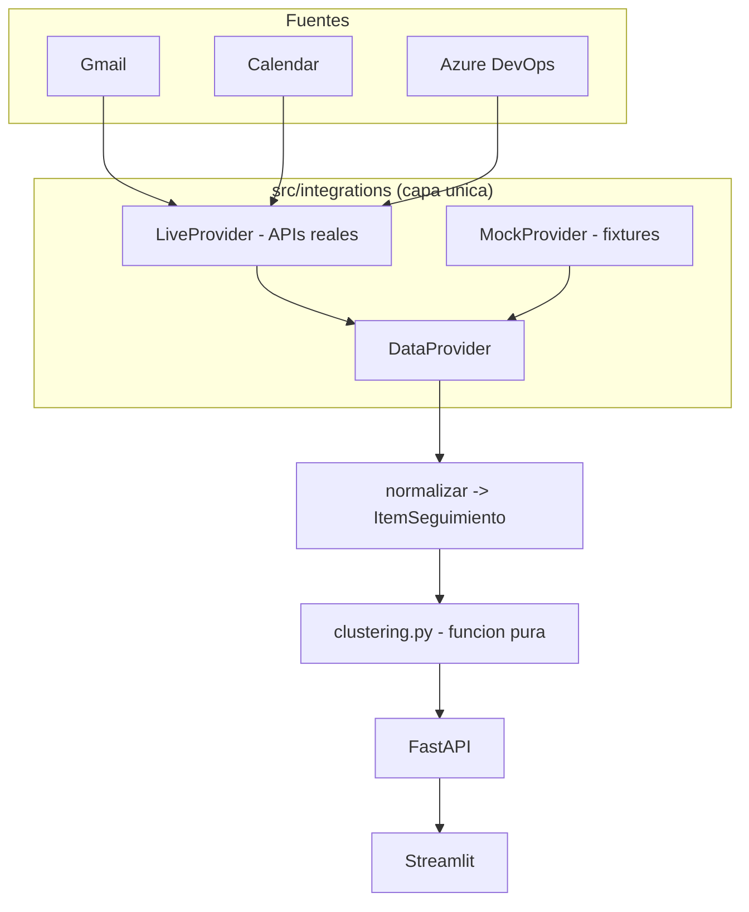

# Diseno tecnico - CDAO Admin Assistant

## Vision general
El sistema consolida tres fuentes (Gmail, Calendar, Azure DevOps) tras una **capa
unica de acceso** (`DataProvider`), normaliza los datos a un modelo comun, los agrupa
por reglas deterministas y los expone via API REST + dashboard.

## Capa de integracion
- `DataProvider` (ABC) define `get_solicitudes()`, `get_reuniones()`, `get_workitems()`,
  todos de solo lectura.
- `MockProvider` lee `data/fixtures/*.json` (datos ficticios).
- `LiveProvider` usa Gmail/Calendar (OAuth readonly) y Azure DevOps (PAT, WIQL).
  Imports de SDKs son perezosos para no exigirlos en modo mock.
- `get_provider()` selecciona la implementacion segun `DATA_PROVIDER`.

## Motor de clustering (`src/clustering.py`)
Funcion pura `cluster_items(items, rules) -> list[Tema]`:
1. Cada `ReglaTema` tiene nombre + keywords. Un item coincide si alguna keyword aparece
   en su texto/etiquetas/proyecto (normalizado a minusculas).
2. Cada item se asigna al **primer** tema cuya regla coincide (orden estable de reglas),
   garantizando pertenencia a exactamente un tema.
3. Items sin coincidencia -> tema `sin_clasificar`.
4. La funcion no lee reloj ni entorno; el orden de salida es determinista (ordenado por
   nombre de tema; items ordenados por id).

Funciones auxiliares:
- `normalizar(solicitudes, reuniones, workitems) -> list[ItemSeguimiento]`.
- `resumir(...) -> ResumenGestion` (totales + top personas).

### Propiedades (para PBT con Hypothesis)
- Particionamiento total y no-perdida (R2.3, R2.7).
- Determinismo (R2.4).
- Estabilidad ante reordenamiento (R2.5).
- Idempotencia (R2.6).

## API (`src/api.py`)
FastAPI con endpoints:
- `GET /solicitudes`, `GET /reuniones`, `GET /workitems`
- `GET /temas` (aplica clustering)
- `GET /resumen` (ResumenGestion)
- `GET /health`

## Dashboard (`src/dashboard.py`)
Streamlit: consume la API (o el provider directo) y muestra tarjetas de totales,
tabla de temas, ranking de personas y filtro por proyecto.

## Seguridad
- Secretos via `.env` (python-dotenv). Nada hardcodeado.
- `security.py` redacta correos en logs/salidas (`REDACT_PII`).
- Modo mock por defecto para demos; datos ficticios `.example`.

## MCP y Power
- MCP Google propio (`powers/cdao-google-power/server.py`) expone tools de solo lectura
  reusando `LiveProvider`.
- Azure DevOps via MCP existente de la comunidad, registrado en `.kiro/mcp.json`.
- El Power del Bonus 2 empaqueta el servidor Google + skills + contexto.
